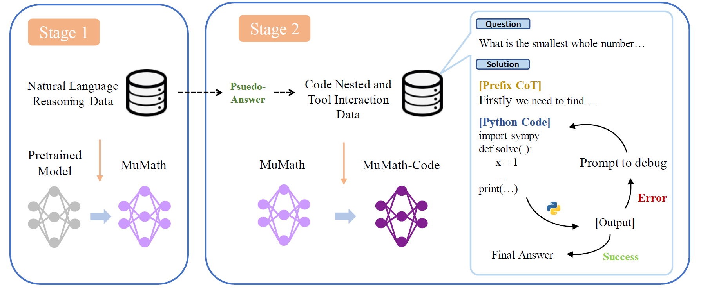

# MuMath-Code: Combining Tool-Use Large Language Models with Multi-perspective Data Augmentation for Mathematical Reasoning

## Introduction

MuMath-Code is a series of tool-use math reasoning LLMs, which are trained using a two-stage strategy: firstly trained on [MuMath-Data](https://huggingface.co/datasets/weihao1/MuMath-Data), then on the proposed multi-perspective and code integrated math reasoning dataset called [MuMath-Code-Data](https://huggingface.co/datasets/weihao1/MuMath-Code-Data). Through such a two-stage training strategy, our MuMath-Code models outperforms the state-of-the-art open methods and even some powerful proprietary ones across different scales on the reasoning datasets. Our work represents a new attempt at integrating mathematical question augmentation (tool-free) with code generation and execution (tool-use) to enhance the mathematical reasoning capabilities of LLMs, and we hope it can inspire subsequent research endeavors.

| Model | Size | GSM8k | MATH |
|---|---|---|---|
| GPT-4 | - | 92.0 | 42.5 |
| GPT-4 (PAL) | - | 94.2 | 51.8 |
||
| ToRA-7B | 7B | 68.8 | 40.1 |
| ToRA-Code-7B | 7B | 72.6 | 44.6 | 
| [MuMath-Code-L-7B](https://huggingface.co/weihao1/MuMath-Code-L-7B) | 7B | **83.8** | <u>48.8</u> | 
| [MuMath-Code-CL-7B](https://huggingface.co/weihao1/MuMath-Code-CL-7B) | 7B | <u>82.6</u> | **52.4** | 
||
| ToRA-13B | 13B |  72.7 | 43.0 |
| ToRA-Code-13B | 13B | 75.8 | 48.1 |
| [MuMath-Code-L-13B](https://huggingface.co/weihao1/MuMath-Code-L-13B) | 13B |  <u>84.3</u> | <u>49.9</u> |
| [MuMath-Code-CL-13B](https://huggingface.co/weihao1/MuMath-Code-CL-13B) | 13B | **84.6** | **53.1** |
||
| ToRA-Code-34B | 34B | 80.7 | 51.0 |
| [MuMath-Code-CL-34B](https://huggingface.co/weihao1/MuMath-Code-CL-34B) | 34B | **87.6** | **55.0** |
||
| ToRA-70B | 70B | 84.3 | 49.7 |
| [MuMath-Code-L-70B](https://huggingface.co/weihao1/MuMath-Code-L-70B) | 70B | **90.7** | <u>52.8</u> |
| [MuMath-Code-CL-70B](https://huggingface.co/weihao1/MuMath-Code-CL-70B) | 70B | <u>89.5</u> | **55.1** |

> The best results are bolded and the second best underlined among the same scale models tested on the same datasets


### MuMath-Code Training Pipeline

<p align="center">
    
    <br>
    <em>Figure 1: The foundation model is first trained through an initial stage, resulting in an intermediary model that possesses more powerful math reasoning capability. This intermediary model is then further trained on the proposed dataset to learn code generation and tool interaction, leading to the final model, MuMath-Code.</em>
</p>


### Setup

We recommend using [Conda](https://docs.conda.io/projects/miniconda) to manage your environment. We use [vLLM](https://github.com/vllm-project/vllm) to accelerate inference. Run the following commands to setup your environment:

```sh
conda create -n mumathcode python=3.10
conda activate mumathcode
pip install packaging==22.0
pip install torch==2.0.1 --index-url https://download.pytorch.org/whl/cu118 # CUDA 11.8 for example
pip install -r requirements-llama.txt # for MuMath-Code-L 
# pip install -r requirements-codellama.txt # for MuMath-Code-CL 
```


### Training

We also open [MuMath-Data](https://huggingface.co/datasets/weihao1/MuMath-Data) and [MuMath-Code-Data](https://huggingface.co/datasets/weihao1/MuMath-Code-Data) for the 1st and the 2nd training stages, respectively.

To train a model, after specifying `MODEL_TYPE`, `TRAIN_FILE`, `MODEL_SAVE`, the conda environment and so on, run the following command:

```sh

# 7B or 13B 
bash scripts/train_7b_13b_stage1.sh 
bash scripts/train_7b_13b_stage2.sh 

# 34B 
bash scripts/train_34b_stage1.sh 
bash scripts/train_34b_stage2.sh 

```

The 70B models can also be trained using the above scripts, given some hyperparameter alterations. However, to speed up, we train our 70B models using Megatron.


### Inference and Evaluation 

We provide scripts for inference and evaluation, simply config the `MODEL_NAME_OR_PATH`, `DATA`, `MODEL_SAVE` and so on in [scripts/infer.sh and run the following command:

```sh
bash scritps/infer.sh
```


## Credits

This project has adopted the [Microsoft Open Source Code of Conduct](https://opensource.microsoft.com/codeofconduct/) and [ToRA](https://github.com/microsoft/tora).

